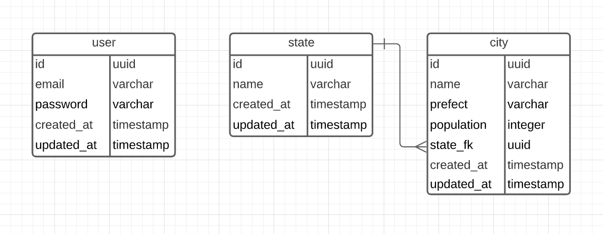

# Desafio 1
O projeto simula uma api de um sistema no qual o usuário tem sua conta e pode fazer transferências.

O projeto foi construido utilizando **Typescript e Javascript na plataforma NodeJs**. Também foram utilizadas algumas bibliotecas: Express, Cors, TypeORM, Drive Postgres, Bcrypt e JsonWebToken. Como banco de dados foi utilizado o Postgres.

# Configurações iniciais
## Instalando dependencias
Antes de tudo precisamos instalar as dependências de nosso projeto. Na raiz do projeto execute o seguinte comando:

```bash
npm install

```

## Configurando conexão com o Banco de Dados
Para aplicação foi utilizado o **Postgres**, então caso utilize outro banco de dados a aplicação pode não responder como o desejado.

Na pasta raiz do projeto podemos encontrar um arquivo `.env.json`, lá você poderá informar os dados para a conexão.

```json
{
  "database": {
    "type": "postgres",
    "host": "localhost",
    "port": 5432,

    "username": "postgres",
    "password": "root",
    "database": "application"
  }
}
```

## Criando uma Build
Agora falta pouco, basta executar o comando abaixo que será gerada uma build de seu projeto, e também serão executadas as migrations no banco de dados. É importante lembrar que você deve ter configurado corretamente os dados de conexão com o banco de dados.

Na raiz do projeto execulte:
```bash
npm run-script build

```

## Iniciando aplicação
```bash
npm start

```

# Usando a API
Para poder visualizar e execultar a ações você pode utilizar o [Insomnia](https://insomnia.rest/).

## Criando um usuário
Você pode acessar a rota: **[/account](http://localhost:3333/account)**, utilizando como método de requisição o **POST**. E passando no corpo da requisição os seguintes dados:
```json
{
	"username": "samuel",
	"email": "guedes.works@gmail.com",
	"cpf": "000.000.000-00",
	"password": "09876",
	"phone": "(69) 9 9373-6357"
}
```

Se tudo ocorrer bem, esta vai ser a **response**:
```json
{
  "account": {
    "code": "161841054518499564",
    "balance": 800.5,
    "username": "samuel",
    "cpf": "000.000.000-00",
    "email": "guedes.works@gmail.com",
    "phone": "(69) 9 9373-6357",
    "id": "dcf8ed09-4432-4efd-8256-20dc75c1b662",
    "created_at": "2021-04-14T14:29:05.187Z",
    "updated_at": "2021-04-14T14:29:05.187Z"
  },
  "token": "eyJhbGciOiJ..."
}
```

## Autenticação de usuário
Você pode acessar a rota: **[/account](http://localhost:3333/account)**, utilizando como método de requisição o **GET**. E passando no corpo da requisição os seguintes dados:
```json
{
	"cpf": "000.000.000-00",
	"password": "09876"
}
```

Se tudo ocorrer bem, esta vai ser a **response**:
```json
{
  "account": {
    "code": "161841054518499564",
    "balance": 800.5,
    "username": "samuel",
    "cpf": "000.000.000-00",
    "email": "guedes.works@gmail.com",
    "phone": "(69) 9 9373-6357",
    "id": "dcf8ed09-4432-4efd-8256-20dc75c1b662",
    "created_at": "2021-04-14T14:29:05.187Z",
    "updated_at": "2021-04-14T14:29:05.187Z"
  },
  "token": "eyJhbGciOiJ..."
}
```

## Criando operação de Débito
Você pode acessar a rota: **[/operation/debit](http://localhost:3333/operation/debit)**, utilizando como método de requisição o **POST**.

> Esta rota é autenticada, então será necessário utilizar seu token de acesso para acessá-la, esse token deverá ser enviado no **Header** da requisição. Lembrando que **o token só é válido durante 24 horas**.

```json
"authorization": "Bearer eyJhbGci..."
```

Será necessário passar no corpo da requisição os seguintes dados:
```json
{
	"destination_account": "161840390065882847",
	"value": 16.90,
	"description": "Pagamento do Spotfy",
	"system": "mobile"
}
```

## Ver operações realizadas
Você pode acessar a rota: **[/operation](http://localhost:3333/operation/debit)**, utilizando como método de requisição o **GET**.

> Esta rota é autenticada, então será necessário utilizar seu token de acesso para acessá-la, esse token deverá ser enviado no **Header** da requisição. Lembrando que **o token só é válido durante 24 horas**.

```json
"authorization": "Bearer eyJhbGci..."
```

## Modelo da Banco de Dados
Modelo das tabelas do Banco de Dados.

